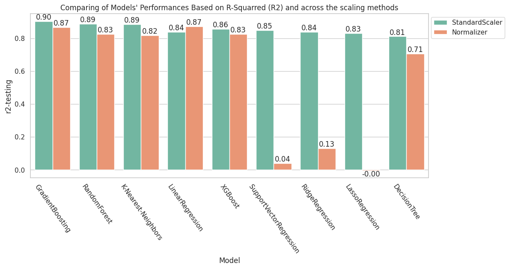

# AutoMPG Machine Learning Project 

Welcome to the AutoMPG Machine Learning Project! This project aims to explore and predict the fuel efficiency (measured in miles per gallon, or MPG) of various automobiles using machine learning techniques. Our endeavor is structured into four distinct phases, each addressing crucial aspects of the data exploration, model building, and experimentation process.

## Project Overview

Our work is segmented into the following major parts:

1. **Exploration and Visualization**: In the first notebook [AutoMPG_EFD](https://github.dev/NalayaData/AutoMPG_ML_project/blob/main/AutoMPG_EDA.ipynb), we delve into the dataset using the powerful data manipulation capabilities of pandas and the visualization prowess of seaborn. This notebook primarily focuses on understanding the structure and characteristics of our data.

2. **Building and Evaluating Regression Models**: Once we have a grasp of the data, we proceed to construct, assess, and refine various regression models using the scikit-learn package. The subsequent notebook, ["AutoMPG_Comparing_ML_Models"](https://github.dev/NalayaData/AutoMPG_ML_project/blob/main/AutoMPG_Comparing_ML_Models.ipynb) details this phase where we aim to identify the most suitable model for our prediction task. 

3. **Developing Simple Deep Learning Models**: In the era of deep learning, we explore the potential of neural networks for regression tasks. Leveraging the Keras sequential package, our "AutoMPG_Keras_DNN_Model" notebook outlines the creation, evaluation, and fine-tuning of a basic deep learning regression model tailored to our dataset. (Upcoming soon)

4. **Experimentation Automation with MLFlow**: Experimentation is key to iterative improvement. In the final phase, we venture into the realm of MLFlow, a powerful tool for tracking and managing machine learning experiments. Our "AutoMPG_MLFlow_AutomatedExperiments" notebook demonstrates how we integrate MLFlow into our workflow to streamline experimentation and enhance reproducibility. (Upcoming soon ..)

Through these concerted efforts, our goal is to gain insights into the factors influencing automobile fuel efficiency and develop accurate predictive models to aid in decision-making processes.
Join us on this exciting journey as we unlock the potential of machine learning in understanding and optimizing auto fuel efficiency!

# About the dataset

## AUTOMPG: Mileage per gallon performances of various cars

The data is technical specification of cars. The dataset is downloaded from UCI Machine Learning Repository. It concerns city-cycle fuel consumption in miles per gallon, to be predicted in terms of 3 multivalued discrete and 5 continuous attributes." (Quinlan, 1993)

#### Source Origin: 

This dataset was taken from the StatLib library which is maintained at Carnegie Mellon University. The dataset was used in the 1983 American Statistical Association Exposition.

#### Attribute Information

-  mpg: continuous
- cylinders: multi-valued discrete
- displacement: continuous
- horsepower: continuous
- weight: continuous
- acceleration: continuous
- model year: multi-valued discrete
- origin: multi-valued discrete
- car name: string (unique for each instance)

#### Key Points about MPG and how values could be interpreted

MPG stands for "Miles Per Gallon." It is a measure of fuel efficiency used primarily in the United States to indicate how many miles a vehicle can travel on one gallon of fuel. The higher the MPG value, the more fuel-efficient the vehicle is, meaning it can travel further on less fuel.

- **Miles** : Represents the distance traveled.
- **Per Gallon** : Represents the amount of fuel used.
- **Calculation** : If a car has an MPG of 30, it means that the car can travel 30 miles on one gallon of fuel.
- **Importance** :
    - **Fuel Efficiency** : Higher MPG values indicate better fuel efficiency, which can save money on fuel costs and is better for the environment due to reduced emissions.
    - **Cost-Effectiveness** : Vehicles with higher MPG ratings are generally cheaper to operate over time.
    - **Environmental Impact** : More fuel-efficient vehicles typically produce fewer greenhouse gas emissions.

